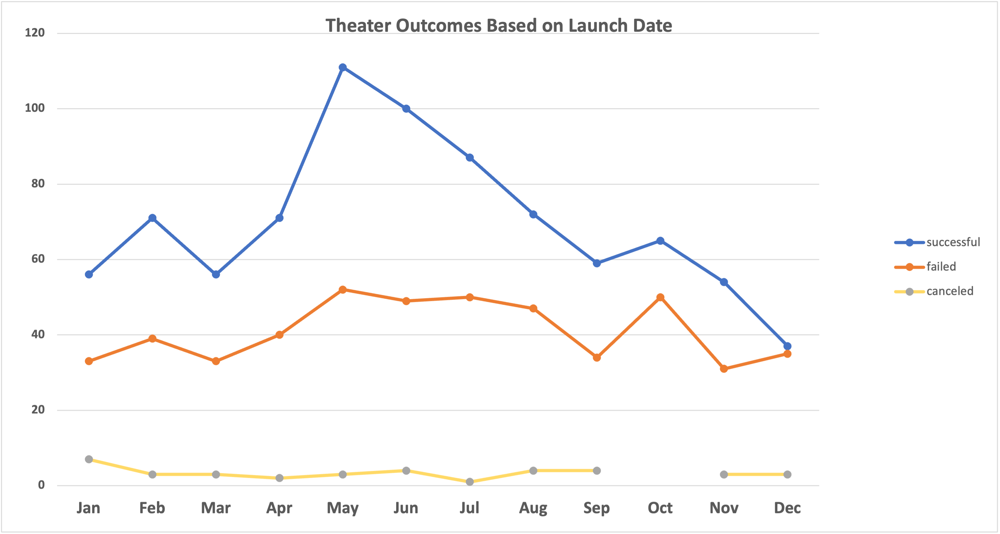

# Launch Date Success: Campaign Analysis
An analysis of kickstarter data for module 1 challenge

## Overview of the Project

### Purpose: 
In the challenge, "Launch Date Success: Campaign Analysis", I assumed the role of an analyst tasked with determining the outcome of various campaigns funding success given their launch date. I was given a data set [Kickstarter Data](Kickstarter_Challenge_1.xlsx), and through various analytical decisions, I was able to filter the data and find crosstabular relationships in order to determine if the launch date of a campaign influenced its success in meeting [campaign] funding goals. 

### Background:
First look at the [Kickstarter Data]("Kickstarter_Challenge_1.xlsx) shows: a massive data set of 4,113 kickstarter campaigns, a quick blurb of what they are about, and column after column of data. This data is what I wanted to condense and filter through. I spent most of my time looking at: the campaign funding goal, how much money was raised through campaigning, if the goal was met, and if the campign was successful in meetings its funding goal. Through the use of pivot tables, line charts, and countif functions, I was able to determine the success of a campaign month-to-month in percentages, pinpoint which months were most fruitful for launch success, and more. I will be showing how I came to my conclusions through an analysis of my work and with the assistance of [visual aid1](Outcomes_vs_Goals.png)  [visual aid2](Theater_Outcomes_vs_Launch.png) 

## Analysis and Challenges

### Analysis of Challenges
#### Challenge 1: 
I wanted to start by figuring out which campaigns met their funding goals based on when they launched. The data provided already laid out whether or not campaigns were successful in meeting their funding goals, so I set out to extract *when* the campign launched. One of the columns provided a Unix timestamp, through use of the YEAR() function on excel, I converted the timestamp to a year and created a new column titled, "Years". 

  
 
 The above image shows the initial Unix timestamp (AA) and the conversion using function YEAR() (AB). This conversion allowed me to further breakdown the data to determine exactly which month each the campaign launched. I then created a pivot table labeled "Theater Outcomes by Launch Date". The pivot table allowed me to filter the converted time stamp from years to months, and filter "Parent Category" to display campaigns labeled 'theater'. The pivot table was setup to display: every campaign within the category "theatre" whether or not they met their campaign funding goals (success, failed, or canceled). The results are included below.

#### Pivot Table for Challenge 1:
While the pivot table provided a more clear understanding of how the success/failure/cancellation outcome was dependent on the launch date. I needed a visualization to determine trends.

This line chart gave me the visualization that I needed. 
#### Line Chart for Challenge 1:

Analysis of the data and charts helped me concluded that the month of May was the most successful month for theatre campaigns to launch and meet their funding goals. This was able to be asessed by seeing the points on the line chart spiking highest in the month of May. Success was determined on whether or not the campaign met its campaign funding/donation goal. In the original data set, column (E) was labeled "pledged" and column (D) was labeled "goal". If (E) > = (D), then the outcome was "successful". However, if (E) < (D), the campaign was labeled "failed". The findings in challenge 1 displayed and measured success on the y-axis with a range of 0-120. Challenge 1 was focused on:

-Filtering the data 

-Determine the relationship between outcome and launch date

-Visualize trends of variable relationship

#### Challenge 2:
Once I had determined the realtionship between launch date and campaign outcomes, I then wanted to figure out just how successful (or not successful) each outcome was. Using the same filtered data from Challenge 1, I now set out to figure out the percentage of success and failure (for each individuals campaign funding goal). In order to do this, I extracted what each campaigns funding goal was from the original data set, broke down the goals into a specified range, and found the percentage of successful/failed/canceled projects-all in a new sheet. Using the COUNTIF() function, I was able to populate my new sheet more efficiently. The results are included below.

My new sheet without any data looked like this. The COUNTIF() function allowed me to populate the sheet into the exact categories that I needed. I wanted every successful,canceled, and failed campaign outcome to be broken down based on how much their funding goal was. I have included some of the specific formulas below.

Cell (B1): 

**-('Kickstarter Data'!)** This pulls data from the original data sheet title "Kickstater Data"

**-($F:$F)** This pulls data from column F

**-("successful")** This pulls every project from column F that is "successful" 

**-($D:$D, "<100")** This pulls every every project from column D that is less than $1000

**-($R:$R, "plays")** This pulls every project from column R that is categorized as a play.

The end results filled cell (B1) with a tally of every project that met all the requirements from that formula and input it. The end result of utilizing the COUNTIF() function is shown below:

The next step was finding the percentage of outcomes. I used the SUM() function to add up all the successful, all the failed, and all the canceled outcomes and created a new column labeled, "Total Projects). 

The SUM() worked horizontally. For example, in order to fill cell (E2), I used the formula =SUM(B2:D2) and got 186. From there I was able to move on to finding percentages.

Finding percentages was as simple as dividing the # of part by the total. For example, in order to fill cell (F2), I simply used =(B2/E2). In the end my complete new sheet looked like this:

This sheet laid out just the information I needed in order to determine the percentage of outcomes for projects based on how much money they wanted to raise. Similar to challenge 1, I needed to visualize in order to determine trends. I created a line chart using the data as shown below.

First glance I immediatley noticed an inverse relationship between the success and failure of the outcomes based on goals. This was noticeable because as we can see in the new sheet, there were only projects that were successful and that failed. There were no canceled projects. This made it a lot easier to visualize the relationship between the goal amount ranges and the percentage of outcome.

### Challenges:

Although I started this project with an idea of what I wanted to figure out, the massive amount of data set out in front of me was overwhelming at first. It was easy to feel lost at times, especially if I was not logging down my process and intentions periodiccally. In order to combat this, I made sure I knew what each column of data represented in the analysis. For example- when I was trying to figure out the percentage of outcomes based on goals- the use of the COUNTIF() function was helpful in separating such a massive amount of data into whatever categorization that I wanted. Without that step I would have been looking at a giant dataset of 1047 projects trying to figure out which column I needed to move the data from and which was just dead weight. Another challenge was knowing which variable went where during the creation of my charts and graphs. But the use of pivot tables was crucial in aiding in creating these visual aids. Knowing which variable is going to go on which axis, which variable will be measured, etc. The use of pivot tables allowed me to move variables around more fluid so I could better determine what relationships I wanted to cross analyze. The challenges I faced in this project stemmed from an excess amount of data. In order to overcome these difficultiues I slowed down, logged my progress, utilized the COUNTIF() and pivot tables,and always kept my objectives in sight.

## Results

### Conclusions for Theater Outcomes by Launch Date:

#### Conclusion 1
May was the most successful month for parent category: theatre projects. Success was determined on whether or not the campaign met its campaign donation goal. 

